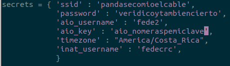
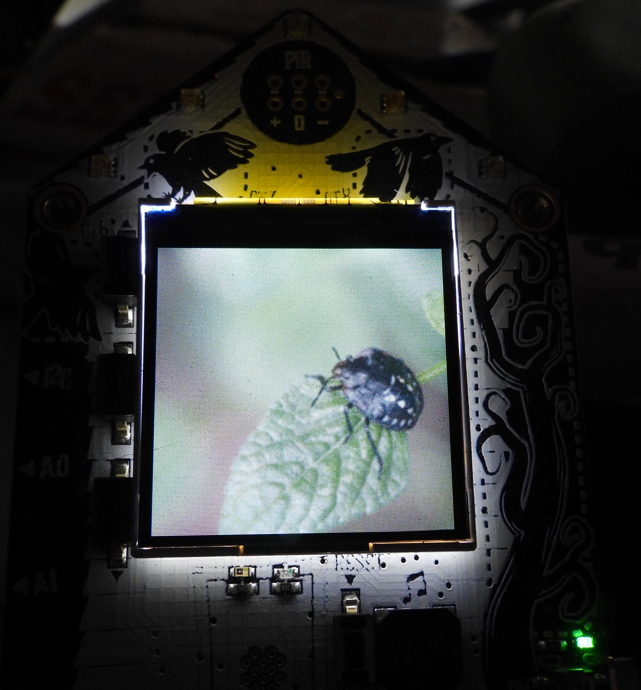

# cpyinaturalist
CircuitPython library for the iNaturalist API

## What is this?

This is a library to managing the iNaturalist API for CircuitPython 6. It is intended to be compatible with [niconoe Pyinaturalist](https://github.com/niconoe/pyinaturalist), but it is not yet.

## Compatible boards

So far, I only have working esp32s2 boards like the Funhouse, and I am working on adding boards like the PyPortal if possible.

## Install

```
circup install adafruit_imageload adafruit_requests adafruit_portalbase 
cp cpyinaturalist.py /media/$USER/CIRCUITPY # Example for Gnu/Linux
```

Now add a like with 'inat_username' into secrets.py, and also remeber to add adafruit_io credentials for the image convertion, and wifi credentials for network access.



## Examples

### Funhouse example.

It downloads images from observations from the username you specify in the ``inat_username`` variable in secrets.py, and displays them on the screen, wait for 30s and the print the species, the username and the observed date.

Go to ``examples`` and copy ``code-funhouse.py`` to ``code.py`` inside the usb folder of the Adafruit Funhouse.



## What can you do?

So far:

- Get a list of observations by running:

```
observations = Cpyinaturalist.get_observations(inat)
```

By user:
```
observations = Cpyinaturalist.get_observations(inat, user_id='fedecrc')
```

By project:
```
observations = Cpyinaturalist.get_observations(inat, project='parque-nacional-isla-del-coco')
```

- Download an image from an observation:

```
Cpyinaturalist.get_image(inat, observations[0]["photos"][0]["small_url"])
```

It uses adafruit_io to transform the image from JPEG to BMP to the resolution of the board you are using, and downloads it to a filename.

*Note: This requires the board to be able to write to the internal memory. For this you need to unplug usb data*.
